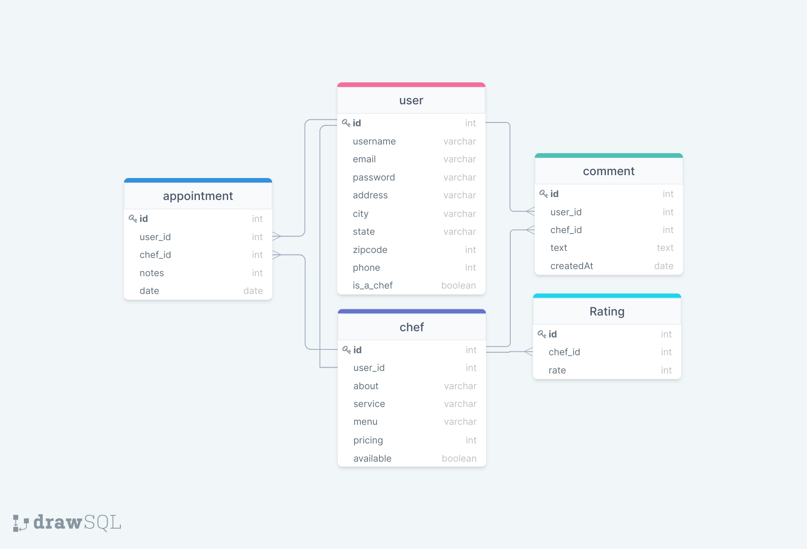

<h1 align="center">
  
   
<h2 align='center'>Documentation</h2>
</h1>
<h1 align="center">
  
  
  
  
</h1>

<h1 align="center">
  Overview
</h1>
<h4 align='center'>
APPRON is a web app that allows user to find chef on demand to cook in your house for your special accasions ( graduation, birthday, baby shower, family gathering, etc ), as well as opening a new opportunity for the chefs to be more productive and flexible with their own time.
</h4>

---

<h1 align="center" >
 
</h1>

<h4 align="center">'APPRON' is a web app inspired by a chef friend who want to get a valuable income and flexible time, as well to help people who need a safe, certified, and experienced chef to make their home event. And I found couple web to be a reference such as 'MeetAChef' and 'ChefOnDemand' that allows users to look for their chef. A logged in users have the ability to search for their chef, make an appointment, give a like and rating, and share their comments & thoughs.
<pFirst_draft is built with React, Flask, Python and PostgreSQL, SQLAlchemy</h4>

---

<h1>Database Schema</h1>

 

---

<h1>Features</h1>

<h3 align='left'>

- Login
- Search for Chef
- Make an Appointment
- Comment ( Chef )
- Like ( Comment )
- Rating ( Chef )

</h3>

---
